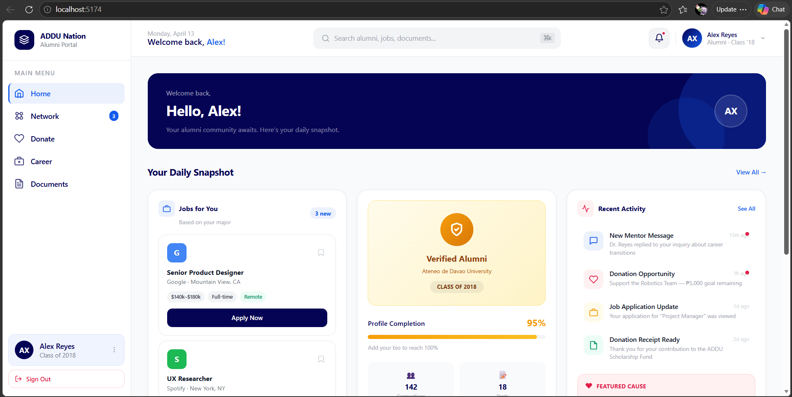
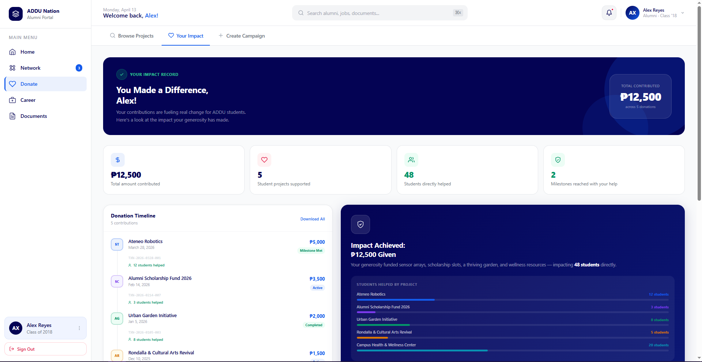
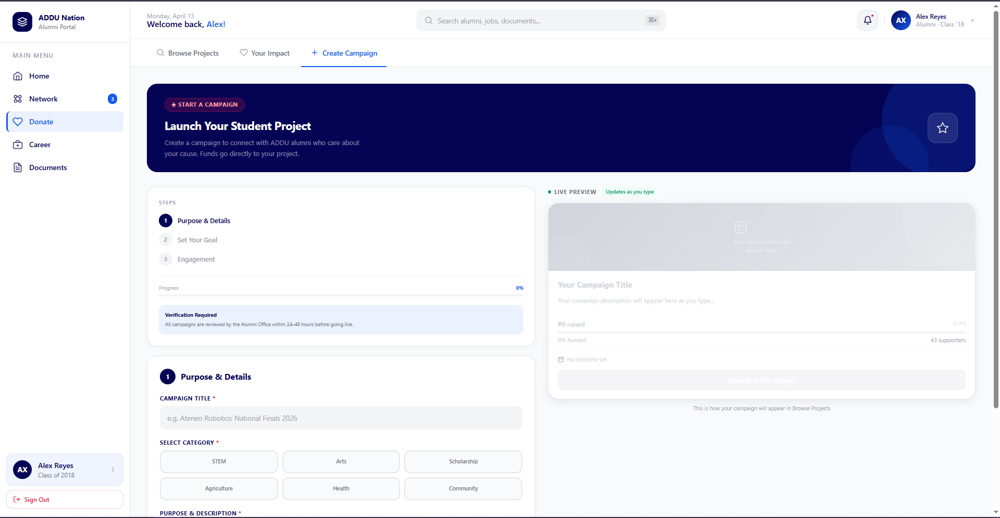
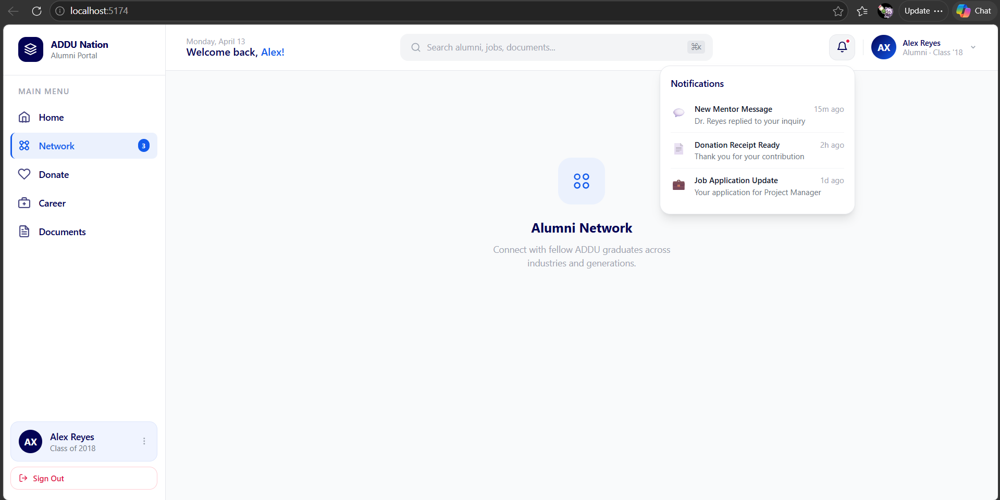
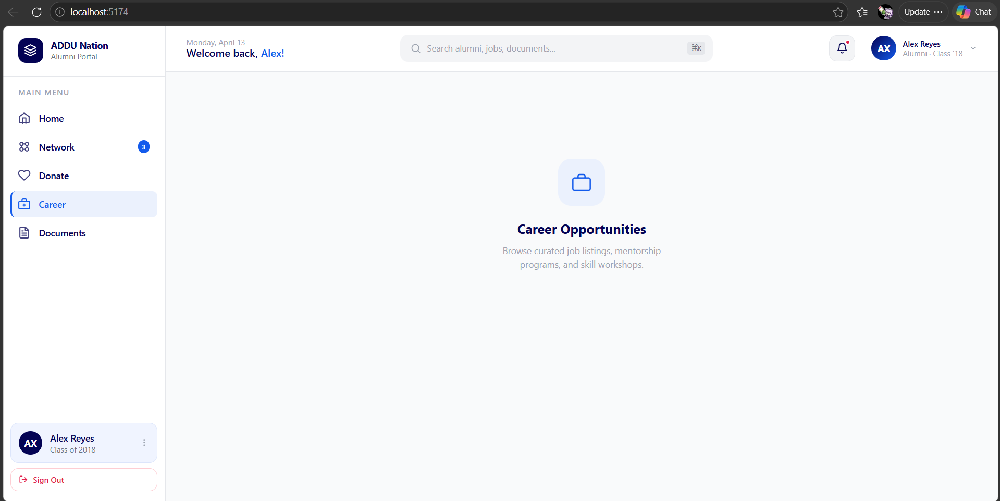
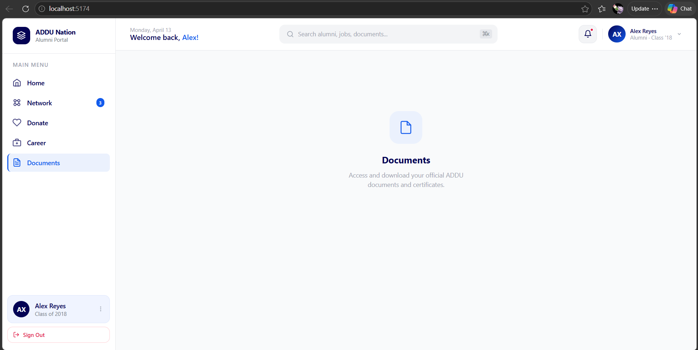

## Manibpel

#### Framework: Solid JS

#### Module: Donation

#### Installation

To replicate and run this project follow the following steps using Command Prompt:

```bash
Make sure you have insalled the ff before cloning:
   1. [Node.js LTS](https://nodejs.org/en/download) — download and install the LTS version
   2. Git — [https://git-scm.com/downloads](https://git-scm.com/downloads)

Step 1: git clone https://github.com/shymanibs/firstattempt2026_Manibpel
Step 2: cd firstattempt2026_Manibpel
Step 3: npm install
Step 4: npm run dev

```

### AI Tools:

1. Claude AI
2. Gemini

### Prompt:
FILES: [Home Alumni User.pdf](https://github.com/user-attachments/files/26664188/Home.Alumni.User.pdf) [Student Project Thank You.pdf](https://github.com/user-attachments/files/26664191/Student.Project.Thank.You.pdf)

1. Make my prompt better for Claude AI and splice them that way I won't accidentally use all my free messages in claude. "As a programmer, create a website using solid JS framework using my app design based on the files and you must convert it to a web page.
   Instructions:
   Convert the figma images to website and make fill in the screen completely there shouldn't be any black spaces

   Palette: #FFFFFF, ##F8F9FA, #040354, #135BEC, and #E11D48" 
   
(Helped with Gemini)First Prompt: Act as a Senior Frontend Developer specializing in SolidJS and Tailwind CSS. I am building a web-only dashboard called 'ADDU Nation' based on my uploaded PDFs. 

Please generate the ff codes:

1.  Sidebar.jsx: A fixed left sidebar (250px). Use a white background with a subtle right border. The navigation links (Home, Network, Donate, Career, Documents) should use Navy (#040354) for text/icons. When a link is 'active', give it a light blue background and a thicker left border using Blue (#135BEC).
2. Header.jsx: A top-bar for the main content area. It needs:
   * A 'Welcome back, Alex!' greeting on the left.
   * A large, centered search bar with a light gray background (`bg-addu-gray`).
   * A profile/notification section on the right.
3. App.jsx: Set up the main layout. Use a two-column grid where the Sidebar stays on the left and the right side scrolls. In the main area, create a 'Daily Snapshot' section with 3 cards (Jobs, Status, Activity) using the designs from 'Home Alumni User.pdf'.
4. State Management: Use `createSignal` to toggle between the 'Home' view and the 'Donate' view. When 'Donate' is active, show a button styled with Rose (#E11D48)."

(Helped with Gemini)Second Prompt: Layout is now working. Let's build the functional components for Phase 2: Alumni User Login & Dashboard.

Requirement: Use strictly SolidJS logic (signals and control flow). Focus only on the Alumni User experience, not the staff.

1. Auth State (App.jsx):
   1. Create a signal `[isLoggedIn, setIsLoggedIn] = createSignal(false)`.
   2. Use SolidJS `<Show>` to toggle between a `Login.jsx` page and the `Dashboard`.
2. Alumni Login (`Login.jsx`):
   1. Build a professional Web Login Page using the Navy (#040354) and Blue (#135BEC) palette.
   2. Features:
      * A 'Welcome to ADDU Nation' hero section.
      * Login form with 'Alumni ID' and 'Password'.
      * A 'Biometric Login' button (matching the icon style in the PDF).
      * Clicking 'Log In' should trigger `setIsLoggedIn(true)`.
3. Home View Content (`Home.jsx`):
   1. Use a 3-column grid to display the 'Daily Snapshot' for the Alumni User:
      * Column 1 (Jobs): Use a `<For>` loop to list job recommendations based on their major.
      * Column 2 (Verification): A card showing a Gold/Yellow 'Verified Alumni' badge and a 95% profile completion bar.
      * Column 3 (Activity): List recent interactions like 'New Mentor Message' and 'Donation Opportunity: Robotics Team'. Use Rose (#E11D48) for the notification indicators.
4. Design:
   1. Maintain the edge-to-edge web dashboard look. All cards should be `bg-white` with `rounded-2xl` corners and soft shadows.
  
(Helped with Gemini)Third Prompt: Phase 2 is working perfectly. Let's move to Phase 3: The Donation Hub.

1. New Component (`DonateView.jsx`):
   1. Create a grid-based gallery of 'Active Student Projects'.
   2. Each card should feature:
   3. A placeholder for a project image.
   4. A Category Tag (e.g., 'STEM', 'Agriculture', 'Arts') using a light blue background.
   5. Progress Bar: A visual bar showing how much of the goal is reached (e.g., '₱45,000 / ₱100,000').
   6. Rose (#E11D48) 'Donate Now' Button: A prominent button at the bottom of the card.
2. Project Data:
   1. Use a SolidJS `<For>` loop to render at least 3 projects:
      1. Project A: 'Ateneo Robotics: National Competition' (Goal: ₱150k).
      2. Project B: 'Urban Garden Initiative' (Goal: ₱50k).
      3. Project C: 'Alumni Scholarship Fund 2026' (Goal: ₱500k).
3. Integration:
   1. Update the `App.jsx` switch logic so that when the Sidebar 'Donate' link is clicked, this `DonateView` fills the main content area.
   2. Ensure the transition is smooth and maintains the Full-Width layout we fixed in Phase 2.
4. Styling Detail:
   1. Use Navy (#040354) for project titles and Blue (#135BEC) for the 'Amount Raised' text.
  
(Helped with Gemini)Fourth Prompt: I am in Phase 4 of a web-only dashboard called 'ADDU Nation' (SolidJS + Tailwind CSS). Use the pasted texts and files as reference and guide.
The Goal: Finalize the 'Module 3: Donate' features with high interactivity 
Brand Identity:

* Navy: `#040354` | Blue: `#135BEC` | Rose: `#E11D48` | Background: `#F8F9FA`
Requirement 1: Your Impact Page (`impact.jsx`)

* Create a 'Donation Timeline'. List past contributions with dates and project names (e.g., '₱5,000 to Robotics - Jan 2026').
* Add a 'Total Impact' card that visualizes how many students were helped.
Requirement 2: Interactive Campaign Creator (`campaign.jsx`)

* Build a split-screen form:
   * Left: A functional form for students to input: Project Name, Goal (₱), and Description.
   * Right: A Live Preview Card. As the user types in the form, the card on the right should update in real-time to show how the project will look in the 'Donation Hub'.
* Use SolidJS `createSignal` for this real-time binding.
Requirement 3: Navigation State

* Ensure the Sidebar 'Donate' link opens a view with three sub-tabs: [Browse Projects], [Your Impact], and [Create Campaign].
Please use the following code as the absolute source of truth for the layout and logic:

   

#### Screenshots

.png)



.png)











## PWA Conversion

### Master Prompt
"I am converting my SolidJS project 'ADDU-NATION' into a PWA. I am using Vite 
and my project structure is standard (entry point is src/index.jsx). Generate a 
valid manifest.json with university branding, register a Service Worker, and 
implement a Cache-First caching strategy so the app loads instantly and works 
offline."

### Files Added
- `public/manifest.json` — PWA identity, icons, theme color `#040354`
- `public/sw.js` — Service Worker with Cache-First for static assets, 
   Network-First for navigation
- Updated `index.html` — manifest link + Apple PWA meta tags
- Updated `src/index.jsx` — Service Worker registration on window load

### AI Hallucinations / Errors Fixed Manually
1. **vite-plugin-pwa version conflict** — AI suggested `vite-plugin-pwa` but it 
   doesn't support Vite 8. Fixed by removing the plugin entirely and using a 
   manual `sw.js` instead.
2. **Wrong base path format** — AI initially needed correction; `base` in 
   `vite.config.js` must be `/firstattempt2026_Manibpel/` not the full GitHub URL.
3. **Merge conflicts** — Resolved using `git checkout --ours` to keep PWA changes.
